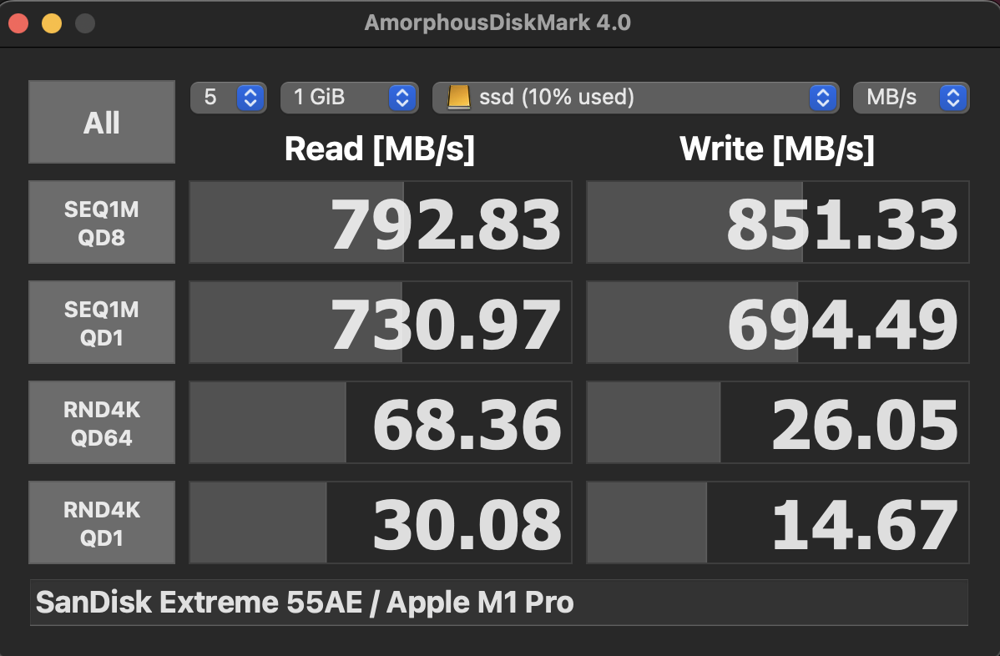
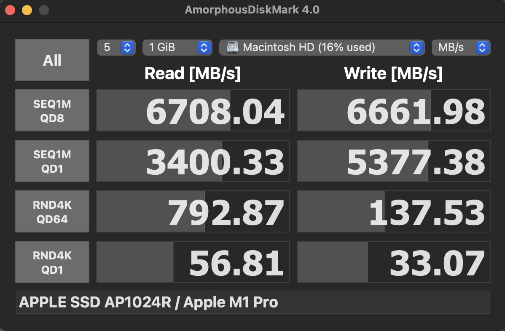

# Setup

## System

Running `system_profiler SPSoftwareDataType SPHardwareDataType SPStorageDataType SPMemoryDataType` gives us some information about our system.

```
Software:

    System Software Overview:

      System Version: macOS 13.1 (22C65)
      Kernel Version: Darwin 22.2.0
      Boot Volume: Macintosh HD
      Boot Mode: Normal
      Secure Virtual Memory: Enabled
      System Integrity Protection: Enabled
      Time since boot: 1 Tag, 6 Stunden und 2 Minuten

Hardware:

    Hardware Overview:

      Model Name: MacBook Pro
      Model Identifier: MacBookPro18,3
      Chip: Apple M1 Pro
      Total Number of Cores: 8 (6 performance and 2 efficiency)
      Memory: 16 GB
      System Firmware Version: 8419.60.44
      OS Loader Version: 8419.60.44
      Activation Lock Status: Disabled

Storage:

    Data:

      Free: 889,24 GB (889.238.786.048 bytes)
      Capacity: 994,66 GB (994.662.584.320 bytes)
      Mount Point: /System/Volumes/Data
      File System: APFS
      Writable: Yes
      Ignore Ownership: No
      BSD Name: disk3s5
      Physical Drive:
          Device Name: APPLE SSD AP1024R
          Media Name: AppleAPFSMedia
          Medium Type: SSD
          Protocol: Apple Fabric
          Internal: Yes
          Partition Map Type: Unknown
          S.M.A.R.T. Status: Verified

    Macintosh HD:

      Free: 889,24 GB (889.238.786.048 bytes)
      Capacity: 994,66 GB (994.662.584.320 bytes)
      Mount Point: /
      File System: APFS
      Writable: No
      Ignore Ownership: No
      BSD Name: disk3s1s1
      Physical Drive:
          Device Name: APPLE SSD AP1024R
          Media Name: AppleAPFSMedia
          Medium Type: SSD
          Protocol: Apple Fabric
          Internal: Yes
          Partition Map Type: Unknown
          S.M.A.R.T. Status: Verified

Memory:

      Memory: 16 GB
      Type: LPDDR5
      Manufacturer: Hynix
```

## Disk

I got two SSD's, one external and one internal. Throughout the project, I will use the external SSD. Although the internal SSD got `10` times faster read & write speeds for sequential data, I don't want to use this space on my new device. Furthermore, this is a great opportunity to test how well my portable SSD performs.

### External (Sandisk extreme Portable 1 TB)



### Internal (Apple SSD 1 TB)



## Memory

According to [Wikipedia](https://en.wikipedia.org/wiki/Apple_M1), the M1 chip has a data rate of $204.8 GByte/s$ which should not be a bottleneck at all. This PC has 16 GB of RAM.

## CPU

The M1 Pro chip is an arm64 based CPU with 2 lightweight and 6 high performance cores. I would also suggest that the chip itself is not a bottleneck. However, the kinda new architecture `arm64` could be a performance hit because most software was/is produced on `amd64`.

### Caches

1. Level
  - 192+128 KB per core (performance cores)
  - 128+64 KB per core (efficient cores)
2. Level 24 Mb (Per performance core, otherwise 4 Mb)
3. Level 24 Mb

## Docker

We will make use of a docker container which can add a little latency which should not hurt. All commands can be executed via the supplied `Makefile`. Take care to enable docker to use enough disk space for images!
